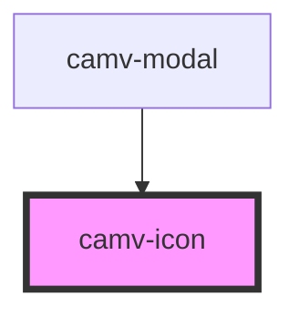

# camv-icon

<!-- Auto Generated Below -->

## Properties

| Property            | Attribute     | Description | Type     | Default     |
| ------------------- | ------------- | ----------- | -------- | ----------- |
| `classNames`        | `class-names` |             | `string` | `''`        |
| `elementId`         | `element-id`  |             | `string` | `undefined` |
| `icon` _(required)_ | `icon`        |             | `string` | `undefined` |

## Dependencies

### Used by

 - [camv-modal](../../molecule/camv-modal)

### Graph

----------------------------------------------

*Built with [StencilJS](https://stenciljs.com/)*
