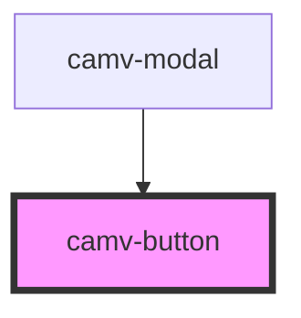

# camv-button

<!-- Auto Generated Below -->

## Properties

| Property     | Attribute     | Description | Type     | Default     |
| ------------ | ------------- | ----------- | -------- | ----------- |
| `classNames` | `class-names` |             | `string` | `undefined` |
| `text`       | `text`        |             | `string` | `undefined` |

## Dependencies

### Used by

 - [camv-modal](../camv-modal)

### Graph

----------------------------------------------

*Built with [StencilJS](https://stenciljs.com/)*
