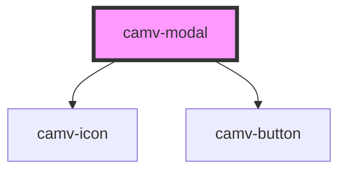

# camv-modal

<!-- Auto Generated Below -->

## Properties

| Property     | Attribute     | Description | Type      | Default     |
| ------------ | ------------- | ----------- | --------- | ----------- |
| `buttons`    | `buttons`     |             | `string`  | `undefined` |
| `classButon` | `class-buton` |             | `string`  | `undefined` |
| `header`     | `header`      |             | `string`  | `undefined` |
| `isopen`     | `isopen`      |             | `boolean` | `undefined` |

## Events

| Event    | Description | Type               |
| -------- | ----------- | ------------------ |
| `action` |             | `CustomEvent<any>` |

## Dependencies

### Depends on

- [camv-icon](../../atom/camv-icon)
- [camv-button](../camv-button)

### Graph

----------------------------------------------

*Built with [StencilJS](https://stenciljs.com/)*
